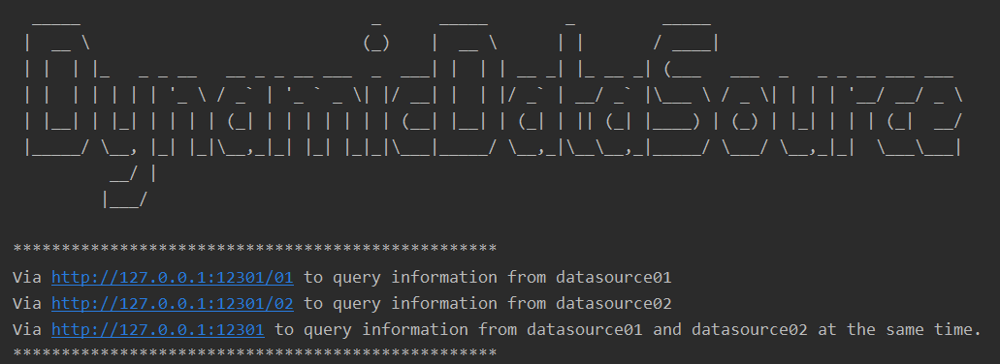
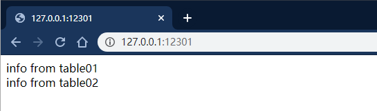

<div align="left">

</div>

# [DynamicDataSource](https://github.com/yeecode/DynamicDataSource)


A tool that allows you to add, delete, and switch data sources while the program is running.

---

[中文文档](./README_CN.md)

---

It is a very common requirement to switch data sources during the program running. It is widely used in many applications such as depots, read and separate applications, multi-tenant applications. DynamicDataSource makes it easy for us to complete this step.

# 1 Characteristics


DynamicDataSource has the following characteristics:

- Basic : Only the most basic data source addition, deletion, and switching functions are implemented, without involving related services.
- Easy To Use : All it takes is a simple configuration and a few method calls.
- Strong Compatibility : When adding a data source, the data source information can come from various methods such as configuration files, web, and database.
- Low Coupling : The operation of switching data sources can be triggered by aspects, logic, and annotations, etc., which can be freely implemented by developers.

There are commonly used methods in DynamicDataSource:

- `boolean addDataSource(DataSourceInfo dataSourceInfo, Boolean overwrite)`：Add a data source, overwrite is used to determine whether to overwrite if a data source with the same name already exists
- `boolean addAndSwitchDataSource(DataSourceInfo dataSourceInfo, Boolean overwrite)`：Add a data source and switch to the data source. Overwrite is used to determine whether to overwrite if a data source with the same name already exists
- `boolean switchDataSource(String dataSourceName)`：Switch to the data source with the specified name
- `boolean delDataSource(String dataSourceName)`：Delete a data source
- `void switchDefaultDataSource()`：Switch to the default data source
- `DataSource getDefaultDataSource()`：Get the default data source

The above methods are multi-thread safe. You can call the above methods in aspects, operation logic, and annotations to complete the dynamic addition, deletion, and switching of data sources.

# 2 Get Started

Provide a sample project under the `\demo` folder for everyone to get started quickly. 

Taking this demo project as an example, we introduce the use of DynamicDataSource.

## 2.1 Introducing Dependencies

Introduce the jar package of DynamicDataSource in the POM file.

```
<dependency>
    <groupId>com.github.yeecode.dynamicdatasource</groupId>
    <artifactId>DynamicDataSource</artifactId>
    <version>{latest_version}</version>
</dependency>
```

## 2.2 Configuration

Write the default data source information in the `application.properties` file, the following is an example. You can modify it according to your own data source.

```
dynamicDataSource.default.url=jdbc:{db}://{pi}:{port}/{database_name}
dynamicDataSource.default.username={username}
dynamicDataSource.default.password={password}
dynamicDataSource.default.driverClassName={dirver}
```

Forbid Spring to load the DataSourceAutoConfiguration class, otherwise this class will load a fixed data source.

```
@SpringBootApplication(exclude = {DataSourceAutoConfiguration.class})
```

Added scanning for beans in the package where the DynamicDataSource is located.

```
@ComponentScan(basePackages = {"com.github.yeecode.dynamicdatasource","{other_package_root}"})
```

## 2.3 Start Using

At this point, all the configuration required to use DynamicDataSource is complete.

We can use `@Autowired` to get DynamicDataSource.

```
@Autowired
private DynamicDataSource dynamicDataSource;
```

We can set up two data sources as described in the `\demo\sql\DDL.md` file, and then test the working of the DynamicDataSource.

Start the DynamicDataSourceDemo project to get the following interface.



For example, we can implement data source switching within an interface, so when the request reaches the `/` interface, the data in the two data sources are queried successively, as shown in the code.

```
@RequestMapping(value = "/")
public String queryFromDS() {
    DataSourceInfo dataSourceInfo = new DataSourceInfo("ds01",
            "com.mysql.cj.jdbc.Driver",
            "jdbc:mysql://localhost:3306/datasource01?useUnicode=true&characterEncoding=UTF-8&serverTimezone=GMT%2B8",
            "root",
            "yeecode");
    dynamicDataSource.addAndSwitchDataSource(dataSourceInfo,true);
    String out = userService.select();

    dataSourceInfo = new DataSourceInfo("ds02",
            "com.mysql.cj.jdbc.Driver",
            "jdbc:mysql://localhost:3306/datasource02?useUnicode=true&characterEncoding=UTF-8&serverTimezone=GMT%2B8",
            "root",
            "yeecode");
    dynamicDataSource.addAndSwitchDataSource(dataSourceInfo,true);
    out += "<br>";
    out += userService.select();
    return out;
}
```
You can get the results shown in the figure below. The following two lines of statements are printed from two data sources.



Data source addition, deletion, and switching operations can be triggered in various aspects such as aspects, business logic, and annotations. DynamicDataSource does not make any restrictions, it is left to developers to implement according to actual needs.